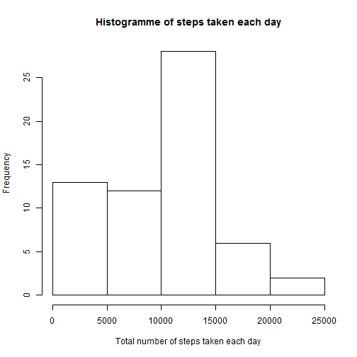
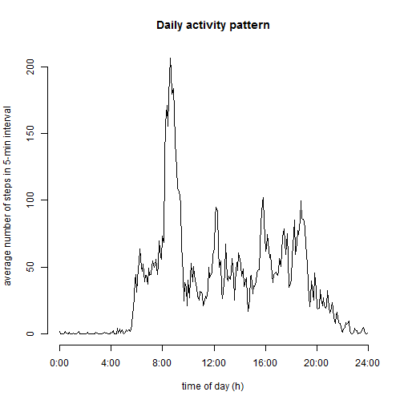
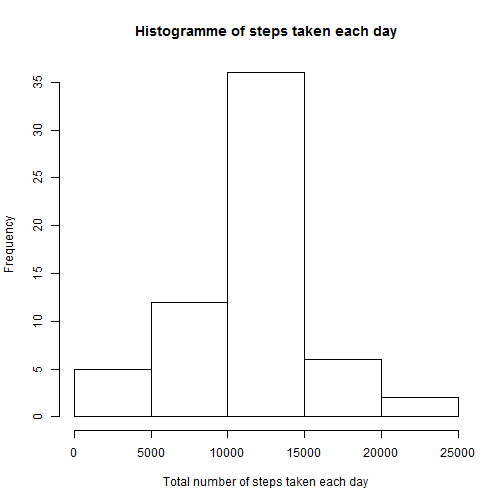
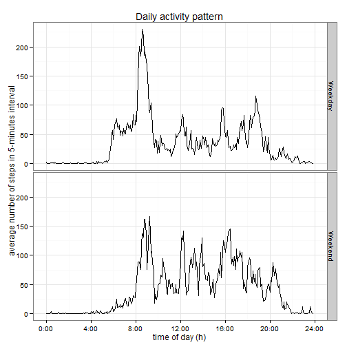

# Loading and preprocessing the data

## 1.Reading the data


```r
#Data importation
data<-read.csv("activity.csv", colClasses=c("integer", "Date", "integer") ,header=TRUE, sep=",")
```

```
## Warning in strptime(xx, f <- "%Y-%m-%d", tz = "GMT"): unable to identify current timezone 'C':
## please set environment variable 'TZ'
```

```
## Warning in strptime(xx, f <- "%Y-%m-%d", tz = "GMT"): unknown timezone
## 'localtime'
```

## 2. Processing data
The main proccessing dutie performed is to let interval variable be a the number the minutes since the day begin.

```r
#Converting interval variable
data$interval <- 60*floor((data$interval+1)/100) + (data$interval %% 100)
```

# What is mean total number of steps taken per day?

## 1. Total number of steps taken per day
Creation of a object to hold the sum of steps for each day

```r
SUM<-tapply(data$steps, data$date, sum, na.rm=T)
```

## 2. Histogram of the total number of steps taken each day
We built the histogram over the previous sum object created

```r
#Histogram of steps taken each day
hist(SUM, main="Histogramme of steps taken each day",xlab="Total number of steps taken each day", ylab="Frequency")
```

 

## 3. Mean and median of the total number of steps taken per day


```r
#Mean calculation
MEAN<-mean(SUM)
round(MEAN,0)
```

```
## [1] 9354
```

```r
#Median calculation
MEDIAN<-median(SUM)
round(MEDIAN,0)
```

```
## [1] 10395
```

#What is the average daily activity pattern ?


```r
#plotting average number of steps on 5-minutes interval
meansteps <- tapply(data$steps, data$interval, mean, na.rm=T)
hours <- as.numeric(names(meansteps))/60
plot(hours, meansteps, type="l", axes=F,
     xlab="time of day (h)", ylab="average number of steps in 5-min interval",
     main="Daily activity pattern")
axis(2)
axis(1, at=0:6*4, labels=paste(0:6*4,":00", sep=""))
```

 


```r
maxstep <- which(meansteps==max(meansteps))
maxinterval <- data$interval[maxstep]
sprintf("%02d:%02d", floor(maxinterval/60), maxinterval %% 60)
```

```
## [1] "08:35"
```
The maximum average number of steps in reach a 08:35
#Imputing missing values


```r
#Calculating the total number of missing values in steps variable
sum(!complete.cases(data$steps))
```

```
## [1] 2304
```
We the a total of 2304 missing values in the steps variable

The missing data the steps variable are now replaced by the average values of steps in the 5-minutes interval.

```r
#Imputing missing data
data_impute<- transform(data, steps=ifelse(!complete.cases(data$steps),meansteps, steps))
summary(data_impute)
```

```
##      steps             date               interval     
##  Min.   :  0.00   Min.   :2012-10-01   Min.   :   0.0  
##  1st Qu.:  0.00   1st Qu.:2012-10-16   1st Qu.: 358.8  
##  Median :  0.00   Median :2012-10-31   Median : 717.5  
##  Mean   : 37.38   Mean   :2012-10-31   Mean   : 717.5  
##  3rd Qu.: 27.00   3rd Qu.:2012-11-15   3rd Qu.:1076.2  
##  Max.   :806.00   Max.   :2012-11-30   Max.   :1435.0
```
Steps mean after imputation is: 10767
Steps mean after imputation is: 10767

```r
tot_impute<- tapply(data_impute$steps, data_impute$date, sum, ra.rm=TRUE)
round(mean(tot_impute),0)
```

```
## [1] 10767
```

```r
round(median(tot_impute),0)
```

```
## [1] 10767
```
As we can notice, the imputation make the mean and median increase.
The mean of steps vary from 9354 before imputation to 10767.
Also, the median of steps vary from 10395 before imputation to 10767.


```r
hist(tot_impute, main="Histogramme of steps taken each day",xlab="Total number of steps taken each day", ylab="Frequency")
```

 

#Are there differences in activity patterns between weekdays and weekends?
Let create the week variable to hold the kind of day (weekday or weekend) according to the varie meeted by the weekdays() function over the date variable from the dataset.

```r
data_impute$week<-ifelse(weekdays(data_impute$date) %in% c("samedi","dimanche"),"Weekend","Weekday")
data_impute$week<-as.factor(data_impute$week)
head(data_impute,4)
```

```
##       steps       date interval    week
## 1 1.7169811 2012-10-01        0 Weekday
## 2 0.3396226 2012-10-01        5 Weekday
## 3 0.1320755 2012-10-01       10 Weekday
## 4 0.1509434 2012-10-01       15 Weekday
```

Before building the plot, let create a new dataset having average values of the steps variable grouped by interval and by the day type(weekday or weekend)

```r
newsteps <- aggregate(data_impute$steps, by=list(interval=data_impute$interval, week=data_impute$week), mean)
```
Let now use the ggplot function the the ggplot2 package to plot the average number of steps in 5-minutes intervalle splitted over the week variable.

```r
library(ggplot2)
g <- ggplot(newsteps, aes(interval/60, x))
g + geom_line() + facet_grid(week ~ .) +
    scale_x_continuous(breaks=0:6*4, labels=paste(0:6*4,":00", sep="")) +
    theme_bw() +
    labs(y="average number of steps in 5-minutes interval") +
    labs(x="time of day (h)") +
    labs(title="Daily activity pattern")
```

 


